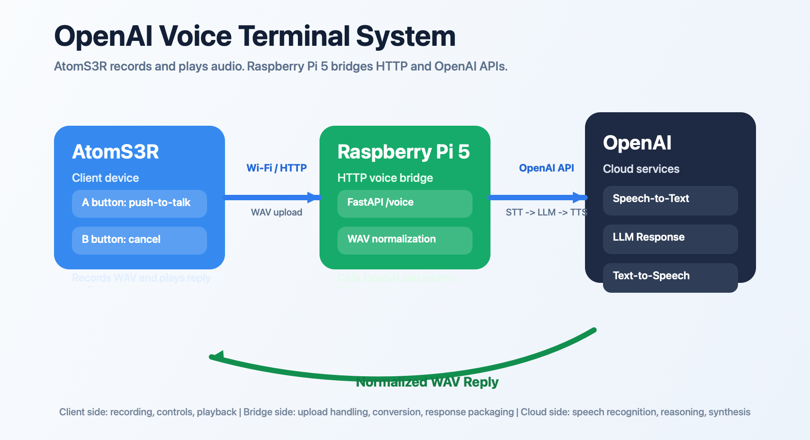
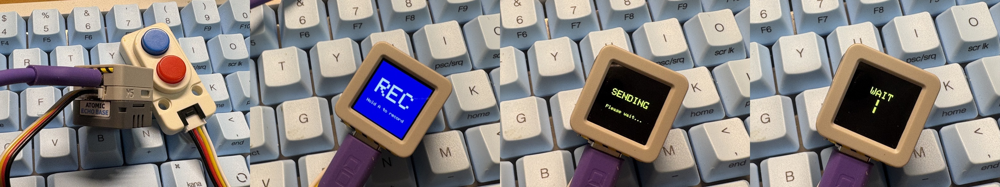

[English (README.md)](./README.md)

# openai-voice-terminal-system

Raspberry Pi 5 側の音声サーバー (`openai-voice-terminal`) と、
AtomS3R 側クライアント (`ATOMS3R-OpenAI-VoicePTT-HTTP`) を統合運用するためのドキュメントリポジトリです。

このリポジトリは実装コード本体を持たず、構成・運用・手順の単一参照点として利用します。

## 対象リポジトリ

- Pi5 サーバー: [omiya-bonsai/openai-voice-terminal](https://github.com/omiya-bonsai/openai-voice-terminal)
- AtomS3R クライアント: [omiya-bonsai/ATOMS3R-OpenAI-VoicePTT-HTTP](https://github.com/omiya-bonsai/ATOMS3R-OpenAI-VoicePTT-HTTP)

## ドキュメント一覧

- [システム概要](./docs/overview.md)
- [アーキテクチャ](./docs/architecture.md)
- [セットアップ手順](./docs/setup.md)
- [運用手順](./docs/operations.md)
- [リポジトリ運用方針](./docs/repositories.md)

## 使い方

1. まず [システム概要](./docs/overview.md) を読む
2. 初回構築は [セットアップ手順](./docs/setup.md) に従う
3. 日常運用は [運用手順](./docs/operations.md) を参照する
4. 変更時は [リポジトリ運用方針](./docs/repositories.md) に従う
