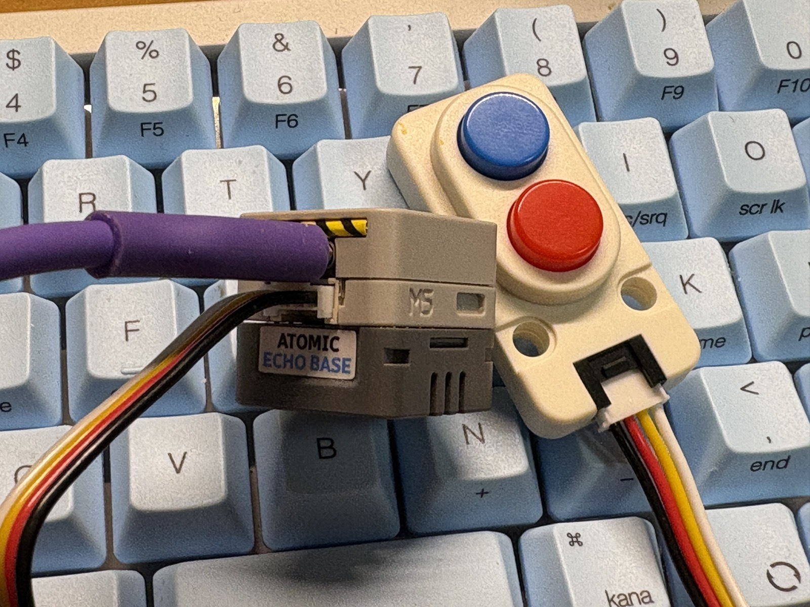
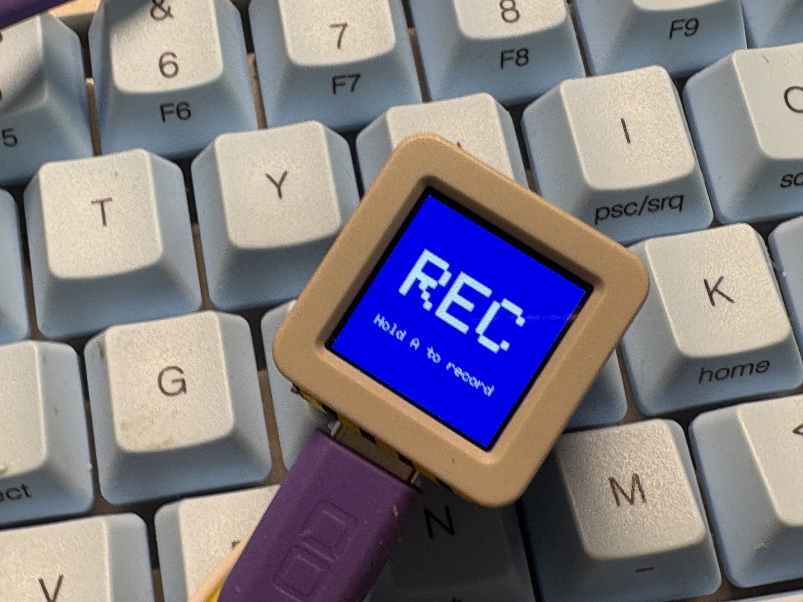
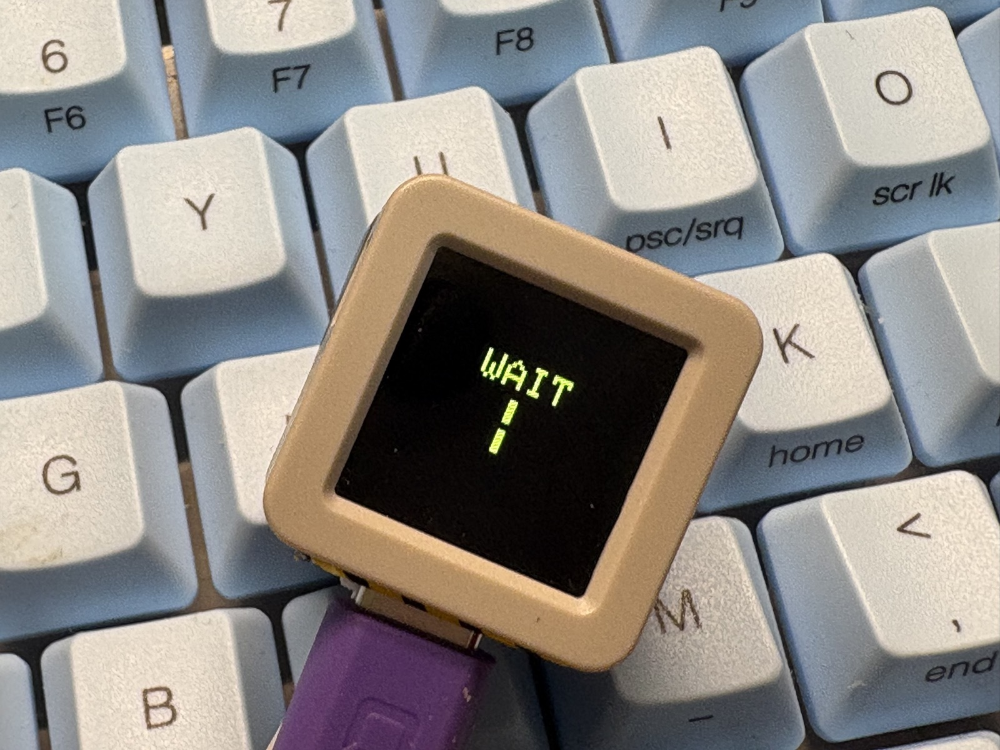

[日本語版 (README.ja.md)](./README.ja.md)

# openai-voice-terminal-system

This repository centralizes documentation for operating the two project repositories together:

- Raspberry Pi 5 voice server: `openai-voice-terminal`
- AtomS3R client firmware: `ATOMS3R-OpenAI-VoicePTT-HTTP`

It does not contain the main implementation code.  
Its role is to provide a single source of truth for architecture, setup, and operations.

## Target Repositories

- Pi5 server: [omiya-bonsai/openai-voice-terminal](https://github.com/omiya-bonsai/openai-voice-terminal)
- AtomS3R client: [omiya-bonsai/ATOMS3R-OpenAI-VoicePTT-HTTP](https://github.com/omiya-bonsai/ATOMS3R-OpenAI-VoicePTT-HTTP)

## Photos

## Documentation

- [System Overview](./docs/overview.en.md)
- [Architecture](./docs/architecture.en.md)
- [Setup Guide](./docs/setup.en.md)
- [Operations Guide](./docs/operations.en.md)
- [Repository Policy](./docs/repositories.en.md)

## How To Use

1. Start with [System Overview](./docs/overview.md).
2. Follow [Setup Guide](./docs/setup.md) for first-time setup.
3. Use [Operations Guide](./docs/operations.md) for daily operation.
4. Follow [Repository Policy](./docs/repositories.md) when making changes.
